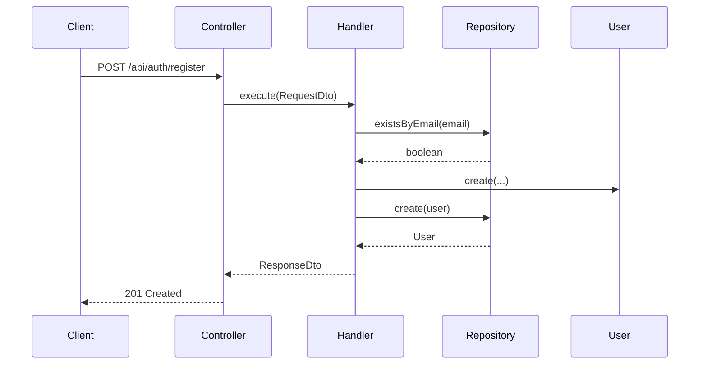

# Use Case Architecture Guide

This document provides clear information about the Clean Architecture approach to use cases.

---

## Table of Contents

1. [Overview](#overview)
2. [Use Case Isolation Pattern](#use-case-isolation-pattern)
3. [Folder Structure](#folder-structure)
4. [File Organization](#file-organization)
5. [Repository Per Operation](#repository-per-operation)
6. [Domain-Driven Design](#domain-driven-design)
7. [Data Transfer Objects (DTOs)](#data-transfer-objects-dtos)
8. [Transactional Pattern](#transactional-pattern)
9. [Boundary Protection](#boundary-protection)
10. [Documentation per Use Case](#documentation-per-use-case)
11. [Adding a New Use Case](#adding-a-new-use-case)

---

## Overview

This architecture follows **Use-Case Isolation** - a strict Clean Architecture pattern where each business operation is encapsulated in its own isolated folder with dedicated files for the use case implementation, data transfer objects (DTOs), and repository interfaces.

### Key Principles

| Principle | Description |
|-----------|-------------|
| **Single Responsibility** | Each use case does exactly one thing |
| **Isolation** | No shared repositories between use cases |
| **Testability** | Each use case can be tested independently |
| **Discoverability** | Use case documentation lives with the code |

### Why Documentation Lives With Code

Co-locating README.md files with use case implementations ensures:
- **Documentation stays current**: When code changes, the adjacent README is a visible reminder to update docs
- **No guessing**: Looking at the folder immediately tells you what's implemented and documented
- **Code reviews include docs**: PR reviewers see doc changes alongside code changes
- **Offline availability**: No dependency on external documentation systems

---

## Use Case Isolation Pattern

### The Rule: One Operation = One Folder

Each CRUD operation (and business operation) has its own folder:

```
modules/{Module}/Application/UseCases/{Action}{Entity}/
├── {Action}{Entity}Handler.php              # Implementation
├── {Action}{Entity}RequestDto.php           # Input validation
├── {Action}{Entity}ResponseDto.php          # Output shape
├── {Action}{Entity}RepositoryInterface.php  # Repository contract
├── Exceptions/                              # Use-case-specific exceptions
│   └── {Specific}Exception.php
└── README.md                                # Use-case documentation
```

### Why No Fat Repositories?

Fat repositories may seem convenient, but they create significant architectural problems:

**Performance Issues**: Fat repositories encourage cross-use-case usage, where unrelated operations are bundled together. This leads to:
- **Over-fetching**: Loading data that specific use cases don't need
- **Extra DB querying**: Generic methods often require multiple round-trips to satisfy specific use cases
- **Lock contention**: Broad transactions hold locks longer than necessary

**Poor Discoverability**: When functionality breaks, you have to guess which of the 15 methods in the fat repository might be involved. With isolated repositories, you start looking in exactly one place: the use case folder.

**Hidden Coupling**: "Just reuse the existing repository" seems efficient, but it couples unrelated use cases through shared data access patterns. Changes for one use case risk breaking others.

**Use Cases as Application Services**: Each use case is essentially an Application Service with a single responsibility. Repository per operation keeps service boundaries clean and prevents leaky abstractions.

**❌ NOT Allowed:**
```php
// Fat repository - couples use cases together
// If you need to optimize how contacts are listed,
// you risk breaking create, update, and delete
interface ContactRepositoryInterface
{
    public function create(Contact $contact): Contact;
    public function findById(string $id): ?Contact;
    public function list(string $userId): array;        // Generic - often over-fetches
    public function update(Contact $contact): Contact;
    public function delete(string $id): void;
}
```

**✅ Correct:**
```php
// CreateContactRepositoryInterface.php - hyper-specific to this operation
// Only methods needed for contact creation
interface CreateContactRepositoryInterface
{
    public function create(Contact $contact): Contact;
    public function existsByEmail(string $userId, string $email): bool;
}

// GetContactRepositoryInterface.php - separate file, separate concerns
// Can be optimized independently without affecting creation logic
interface GetContactRepositoryInterface
{
    public function findById(string $id): ?Contact;
}
```

---

## Folder Structure

### Domain Organization

Organize use cases by module (bounded context), with each operation in its own folder:

```
modules/
├── Auth/
│   └── Application/
│       └── UseCases/
│           ├── RegisterUser/
│           ├── LoginUser/
│           └── LogoutUser/
├── Member/
│   └── Application/
│       └── UseCases/
│           ├── CreateMember/
│           ├── GetMember/
│           ├── ListMembers/
│           └── UpdateMember/
└── {Module}/
    └── Application/
        └── UseCases/
            └── {Action}{Entity}/
```

---

## File Organization

### Standard Files Per Use Case

Every use case folder contains these files:

| File | Purpose | Example |
|------|---------|---------|
| `{Action}{Entity}Handler.php` | Core use case logic | `RegisterUserHandler.php` |
| `{Action}{Entity}RequestDto.php` | Input validation | `RegisterUserRequestDto.php` |
| `{Action}{Entity}ResponseDto.php` | Output structure | `RegisterUserResponseDto.php` |
| `{Action}{Entity}RepositoryInterface.php` | Repository contract | `RegisterUserRepositoryInterface.php` |
| `Exceptions/` | Use-case-specific exceptions | `EmailAlreadyExistsException.php` |
| `README.md` | Documentation | See [Documentation per Use Case](#documentation-per-use-case) |

### Example: Register User Use Case

```php
// RegisterUserHandler.php
final readonly class RegisterUserHandler
{
    public function __construct(
        private RegisterUserRepositoryInterface $repository,
        private PasswordHasherInterface $passwordHasher,
        private TransactionInterface $transaction,
    ) {}

    public function execute(RegisterUserRequestDto $request): RegisterUserResponseDto
    {
        return $this->transaction->execute(function () use ($request) {
            // Check for duplicate email
            if ($this->repository->existsByEmail($request->email)) {
                throw new EmailAlreadyExistsException($request->email);
            }

            // Check for duplicate username
            if ($this->repository->existsByUsername($request->username)) {
                throw new UsernameAlreadyExistsException($request->username);
            }

            // Create domain entity
            $user = User::create(
                email: Email::fromString($request->email),
                username: Username::fromString($request->username),
                password: HashedPassword::fromPlainString($request->password),
                fullName: UserFullName::fromStrings($request->firstName, $request->lastName),
            );

            // Persist
            $savedUser = $this->repository->create($user);

            return new RegisterUserResponseDto(
                id: $savedUser->id(),
                email: $savedUser->email()->value(),
                username: $savedUser->username()->value(),
            );
        });
    }
}
```

---

## Repository Per Operation

### Repository Interface Location

The use case **owns** its repository interface:

```php
// RegisterUserRepositoryInterface.php (inside UseCases/RegisterUser/)
interface RegisterUserRepositoryInterface
{
    public function create(User $user): User;
    public function existsByEmail(string $email): bool;
    public function existsByUsername(string $username): bool;
}
```

### Repository Implementation Location

Implementations live in the Infrastructure layer:

```
modules/{Module}/Infrastructure/Persistence/Repositories/
├── RegisterUserRepository.php
├── LoginUserRepository.php
├── GetUserRepository.php
├── UpdateUserRepository.php
└── DeleteUserRepository.php
```

**Naming Pattern:** `{Action}{Entity}Repository.php` (e.g., `RegisterUserRepository`, `GetMemberRepository`)

### Registration in ServiceProvider

Register each repository implementation with its interface:

```php
// modules/{Module}/Infrastructure/Providers/{Module}ServiceProvider.php
class AuthServiceProvider extends ServiceProvider
{
    public function register(): void
    {
        // Repository interface bindings (one per use case)
        $this->app->bind(
            RegisterUserRepositoryInterface::class,
            RegisterUserRepository::class
        );
        $this->app->bind(
            LoginUserRepositoryInterface::class,
            LoginUserRepository::class
        );
        $this->app->bind(
            GetUserRepositoryInterface::class,
            GetUserRepository::class
        );
    }
}
```

---

## Domain-Driven Design

### Why Pure Domain Entities?

Domain entities without framework dependencies:
- **Testable without infrastructure**: Run unit tests without database or any framework
- **Portable logic**: Business rules can move between frameworks (Laravel, Symfony, etc.)
- **Explicit business intent**: Methods like `blacklist()` express domain concepts, not technical operations
- **Immutable state changes**: State changes happen through methods, not direct property assignment

### Domain Entity Usage

Use cases operate on pure domain entities:

```php
// Domain/Entities/Contact.php - no framework dependencies
final class Contact
{
    private function __construct(
        private readonly string $id,
        private string $name,
        private bool $isBlacklisted = false,
        private DateTimeImmutable $updatedAt,
    ) {}

    public static function create(string $name): self
    {
        return new self(
            id: generateId(),
            name: $name,
            isBlacklisted: false,
            updatedAt: new DateTimeImmutable(),
        );
    }

    // Domain behavior expressed as methods, not property setters
    public function blacklist(): void
    {
        $this->isBlacklisted = true;
        $this->updatedAt = new DateTimeImmutable();
    }

    // Read-only properties exposed via getters
    public function id(): string { return $this->id; }
    public function name(): string { return $this->name; }
    public function isBlacklisted(): bool { return $this->isBlacklisted; }
}
```

### Factory Pattern

Always use factory methods, never constructors directly:

```php
// ✅ Correct
$contact = Contact::create('John Doe');

// ❌ Wrong - constructor should be private
$contact = new Contact('id', 'John Doe', false, new DateTimeImmutable());
```

### Why Factory Methods?

Factory methods provide architectural benefits that constructors cannot:

**Named Construction**: `Contact::createVerified()` vs `new Contact(..., true, ...)` — the intent is clear from the method name, not from boolean flags. Constructors are always named after the class; factories can have descriptive names for each creation scenario.

**Testability**: You can mock or spy on `Contact::create` in tests, which is impossible with the `new` operator. This allows tests to control object creation without dependency injection frameworks.

### Why Behavior Through Methods?

Domain behavior is expressed as methods, not property setters:

```php
// ✅ Business intent is clear
$contact->blacklist();
$contact->activate();
$contact->mergeWith($otherContact);

// ❌ Unclear what these operations mean
$contact->isBlacklisted = true;
$contact->status = 'active';
```

**Encapsulation**: Methods hide internal state changes. `blacklist()` might set a flag, log an audit entry, and update a timestamp — callers don't need to know.

**Invariant Enforcement**: Methods validate before changing state. `setEmail()` can check format and uniqueness; direct assignment cannot.

**Domain Language**: Methods named after business concepts (`suspend()`, `promote()`, `archive()`) make the code readable to domain experts.

**Side Effects**: Domain events (e.g., `ContactWasBlacklisted`) can be emitted from methods, not from property assignments.

### Why Getters?

Exposing read-only properties via getters:

```php
public function id(): string { return $this->id; }
```

**Read-Only Access**: External code can observe state but cannot corrupt it through direct assignment.

**Encapsulation**: The internal representation can change (e.g., `$id` becomes a Value Object) without affecting callers.

**Computed Properties**: Getters can derive values on-demand without storing redundant state.

**Defensive Copying**: Getters can return copies of mutable objects (arrays, dates) to prevent external modification.

---

## Data Transfer Objects (DTOs)

### Why DTOs?

DTOs decouple internal domain models from external interfaces:

```php
// RegisterUserRequestDto.php - what the caller provides
final readonly class RegisterUserRequestDto
{
    public function __construct(
        public string $email,
        public string $username,
        public string $password,
        public string $firstName,
        public string $lastName,
    ) {}
}

// RegisterUserResponseDto.php - what the use case returns
final readonly class RegisterUserResponseDto
{
    public function __construct(
        public string $id,
        public string $email,
        public string $username,
    ) {}
}
```

**Validation Separation**: Request DTOs validate at the boundary (using Form Requests) before data reaches domain logic. Invalid inputs are rejected early.

**Contract Stability**: The API contract (DTOs) can remain stable while the domain model evolves. Adding a field to the User entity doesn't automatically expose it to callers.

**Security**: DTOs prevent accidental data leakage. Sensitive fields (passwords, internal IDs) aren't exposed unless explicitly included in the response DTO.

**Decoupling**: Changes to the domain (e.g., splitting `name` into `firstName` and `lastName`) don't require changes to callers if the DTO remains compatible.

### Mapping Layers

Use cases act as the mapping layer between DTOs and domain entities:

```php
// Request DTO → Domain Entity
$user = User::create(
    email: Email::fromString($request->email),
    username: Username::fromString($request->username),
    password: HashedPassword::fromPlainString($request->password),
    fullName: UserFullName::fromStrings($request->firstName, $request->lastName),
);

// Domain Entity → Response DTO
return new RegisterUserResponseDto(
    id: $user->id(),
    email: $user->email()->value(),
    username: $user->username()->value(),
);
```

---

## Transactional Pattern

### Why Transactions Are Mandatory

Without explicit transactions:
- **Partial failures**: Database operations may partially complete, leaving data in inconsistent states
- **Connection leaks**: Uncommitted work holds database connections open longer
- **Race conditions**: Concurrent operations see intermediate states
- **Rollback impossible**: Errors after partial writes can't be undone cleanly

### All DB Operations Must Be Transactional

```php
// ✅ Correct - wrapped in transaction
final readonly class RegisterUserHandler
{
    public function __construct(
        private RegisterUserRepositoryInterface $repository,
        private TransactionInterface $transaction,
    ) {}

    public function execute(RegisterUserRequestDto $request): RegisterUserResponseDto
    {
        return $this->transaction->execute(function () use ($request) {
            // All DB operations within transaction
            $user = User::create(...);
            return $this->repository->create($user);
        });
    }
}

// ❌ Wrong - never outside transaction
final readonly class RegisterUserHandler
{
    public function execute(RegisterUserRequestDto $request): RegisterUserResponseDto
    {
        $user = User::create(...);
        return $this->repository->create($user);  // If this fails, entity may be partially persisted
    }
}
```

### Transaction Interface

```php
// Core/Application/Contracts/TransactionInterface.php
interface TransactionInterface
{
    /**
     * @template T
     * @param callable(): T $callback
     * @return T
     */
    public function execute(callable $callback): mixed;
}
```

---

## Boundary Protection

### Repositories Deal in Entities

Repositories are the bridge between domain and infrastructure. They accept and return domain entities, not database rows or Eloquent models:

```php
// ✅ Repository accepts and returns domain entities
interface CreateContactRepositoryInterface
{
    public function create(Contact $contact): Contact;
}

// Implementation maps between entity and persistence model internally
final readonly class CreateContactRepository implements CreateContactRepositoryInterface
{
    public function create(Contact $contact): Contact
    {
        $model = new ContactModel;
        $model->id = $contact->id();
        $model->name = $contact->name();
        $model->email = $contact->email()->value();
        $model->save();

        return ContactMapper::toDomain($model->fresh());
    }
}
```

**Domain Integrity**: The domain model remains pure. The repository handles the messy mapping between entities and persistence structures.

**Swappable Infrastructure**: You can switch from MySQL to PostgreSQL without touching use cases — only the repository implementations change.

**Testability**: Repositories can be mocked with in-memory implementations that deal in entities, no database required.

**No Leaky Abstractions**: Callers never see database specifics (table names, column types, JOINs). They work with domain concepts only.

### Use Cases Don't Call Each Other

Each use case is a standalone entry point. They never invoke each other directly:

```php
// ❌ WRONG - use cases calling each other
final readonly class CreateOrderHandler
{
    public function __construct(
        private GetProductHandler $getProductHandler,  // Don't do this
    ) {}

    public function execute(CreateOrderRequestDto $request): CreateOrderResponseDto
    {
        $product = $this->getProductHandler->execute(new GetProductRequestDto(  // Tight coupling!
            id: $request->productId,
        ));
        // ...
    }
}
```

```php
// ✅ CORRECT - use case orchestrates, repository provides data access
final readonly class CreateOrderHandler
{
    public function __construct(
        private CreateOrderRepositoryInterface $repository,
        private TransactionInterface $transaction,
    ) {}

    public function execute(CreateOrderRequestDto $request): CreateOrderResponseDto
    {
        return $this->transaction->execute(function () use ($request) {
            // Delegate pure business rules to domain entity
            // Order::create validates: items not empty, quantities positive, prices non-negative
            $order = Order::create(items: $request->items);

            // Business rules requiring data access
            $productIds = array_map(fn($item) => $item->productId, $order->items());

            $existenceMap = $this->repository->productsExist($productIds);
            $missingProducts = array_filter($productIds, fn($id) => !$existenceMap[$id]);

            if (count($missingProducts) > 0) {
                throw new ProductsNotFoundException(
                    sprintf('Products not found: %s', implode(', ', $missingProducts))
                );
            }

            // NOTE: There might be a race condition here, in a real-world scenario
            // we would check stock levels, reserve the stock, then create the order.
            $stockLevels = $this->repository->getStockForProducts($productIds);
            foreach ($order->items() as $item) {
                $available = $stockLevels[$item->productId] ?? 0;
                if ($available < $item->quantity) {
                    throw new InsufficientStockException(
                        sprintf('Insufficient stock for product %s', $item->productId)
                    );
                }
            }

            return $this->repository->create($order);
        });
    }
}

// Repository interface - provides data, not business logic
interface CreateOrderRepositoryInterface
{
    /**
     * @param array<string> $productIds
     * @return array<string, bool> Map of productId => exists
     */
    public function productsExist(array $productIds): array;

    /**
     * @param array<string> $productIds
     * @return array<string, int> Map of productId => stock level
     */
    public function getStockForProducts(array $productIds): array;

    public function create(Order $order): Order;
}

// Implementation - SQL queries only, no business decisions
final readonly class CreateOrderRepository implements CreateOrderRepositoryInterface
{
    public function productsExist(array $productIds): array
    {
        $results = DB::table('products')
            ->whereIn('id', $productIds)
            ->pluck('id')
            ->toArray();

        $existenceMap = [];
        foreach ($productIds as $id) {
            $existenceMap[$id] = in_array($id, $results);
        }
        return $existenceMap;
    }

    public function getStockForProducts(array $productIds): array
    {
        $results = DB::table('inventory')
            ->whereIn('product_id', $productIds)
            ->get(['product_id', 'stock']);

        $stockMap = [];
        foreach ($results as $row) {
            $stockMap[$row->product_id] = $row->stock;
        }
        return $stockMap;
    }

    public function create(Order $order): Order
    {
        $model = new OrderModel;
        $model->id = $order->id();
        $model->customer_id = $order->customerId();
        $model->status = $order->status()->value();
        $model->total = $order->total();
        $model->save();

        return OrderMapper::toDomain($model->fresh());
    }
}
```

**Single Entry Point**: Each use case represents one user intention. If you need the same logic in two places, extract shared domain logic into the entity or a domain service, not into a use case.

**Transaction Boundaries**: Each use case defines its own transaction scope. Calling another use case could commit or roll back data unexpectedly.

**Testability**: Use cases with no dependencies on other use cases are easier to test in isolation.

**Clarity**: When you see a use case being invoked, you know it's a top-level operation initiated by a user or external system, not an internal detail.

**Reusability Through Domain**: Shared logic belongs in the domain (entities, value objects, domain services), not in use cases. Use cases orchestrate; domains encapsulate business rules.

---

## Documentation per Use Case

### Where to Find Documentation

Each use case folder contains a `README.md` with:
- Use case ID and description
- Actors and stakeholders
- Preconditions and postconditions
- Main flow and alternate flows
- Business rules
- Sequence diagrams
- Error scenarios

### Example Structure

```markdown
# UC-AUTH-001: Register User

## Overview
Description and trigger information.

## Actors
- Primary: Guest User
- Secondary: System

## Preconditions
- P1: User is not authenticated
- P2: Email is valid format
- P3: Username meets format requirements

## Postconditions
- PS1: User account created
- PS2: Member profile created
- PS3: Authentication token returned

## Main Flow
1. Validate request data
2. Check for duplicate email
3. Check for duplicate username
4. Create User entity
5. Create Member entity
6. Persist transactionally
7. Generate auth token
8. Return response

## Alternate Flows
- AF-1: Duplicate email → 409 Conflict
- AF-2: Duplicate username → 409 Conflict
- AF-3: Invalid email format → 422 Unprocessable Entity

## Sequence Diagram


## Business Rules
- BR-1: Email must be unique across all users
- BR-2: Username must be unique across all users
- BR-3: Password must meet minimum complexity requirements
```

### Accessing Use Case Documentation

Navigate to any use case folder to find its documentation:

```bash
cd modules/Auth/Application/UseCases/RegisterUser/
cat README.md
```

---

## Adding a New Use Case

### Steps

1. **Create folder** in appropriate module: `modules/{Module}/Application/UseCases/{Action}{Entity}/`
2. **Create Handler**: `{Action}{Entity}Handler.php`
3. **Create Request DTO**: `{Action}{Entity}RequestDto.php`
4. **Create Response DTO**: `{Action}{Entity}ResponseDto.php`
5. **Create Repository Interface**: `{Action}{Entity}RepositoryInterface.php`
6. **Create exceptions** (if needed): `Exceptions/{Specific}Exception.php`
7. **Create README.md** with documentation
8. **Implement Repository** in Infrastructure layer
9. **Register in ServiceProvider**

### Checklist

- [ ] Folder created: `modules/{Module}/Application/UseCases/{Action}{Entity}/`
- [ ] Handler implements single responsibility
- [ ] Request DTO validates input (or delegates to Form Request)
- [ ] Response DTO defines output shape
- [ ] Repository interface defined in use-case folder
- [ ] Repository implementation in Infrastructure/Persistence/Repositories/
- [ ] Use-case-specific exceptions created
- [ ] README.md with full documentation
- [ ] Registered in dependency injection container (ServiceProvider)
- [ ] Transaction wrapper applied for write operations

---

## Strict Constraints

### Do NOT Do These

| Constraint | Reason |
|------------|--------|
| **No Generic/Fat Repositories** | Do NOT create aggregated repository classes or interfaces. Every database operation must have its own dedicated, single-purpose repository. |
| **No Dependencies in Domain** | The Domain layer must have zero dependencies - no framework, no external libraries, nothing. Only pure PHP with business logic. Dependencies are injected from the Application or Infrastructure layers. |
| **No Framework Bleed** | Do not leak any framework-specific tools (decorators, attributes, facades, ORM annotations, etc.) into the core Domain entities or pure business logic. |
| **No Repositories in Domain Layer** | Do not use repositories or database access logic in the Domain layer. Repositories belong in the Infrastructure layer and their interfaces in the Application layer. |
| **No Magic Strings** | All string literals that represent meaningful values (statuses, sources, types, categories, etc.) MUST be declared as constants/enums. DO NOT use hardcoded strings like `'in_review'`, `'published'`, etc. |
| **No Env Var Fallbacks** | NEVER use `env('X') ?? 'default'` or `config('x') ?? 'default'` patterns for required values. Use `config('x')` and ensure the value is set, or let the application fail loudly. |
| **No Cross-Handler Calls** | Use cases must NOT call other use cases directly. Extract shared logic to domain entities or domain services. |
| **No Comments** | Prefer code that is self-explanatory. Every comment represents a failure to make the code clear. Use comments only as a last resort. |
